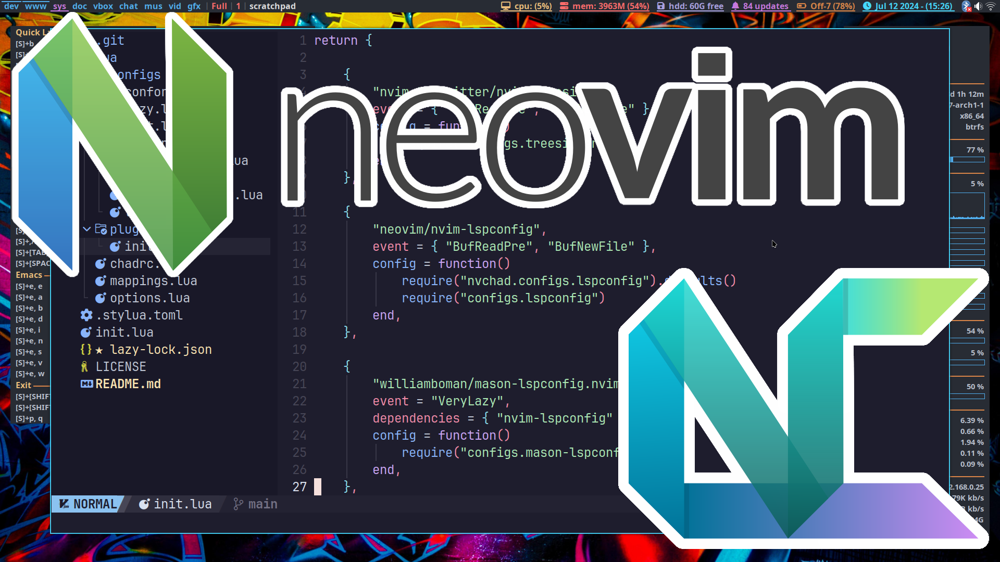

# Install NvChad

To install NvChad with support for C/C++ on Termux, run the following command:

```
git clone https://github.com/OxRachid/NvchadNeovimCppx ~/.config/nvim && nvim
```

## Additional Setup for Termux

After installing NvChad, make sure to manually install the following tools to fully support your C/C++ development environment:

1. **Lua Language Server (`lua-ls`)**
2. **Stylua**
3. **Clangd**
4. **Clang-Format**
 

## Add Tools to PATH

After installing the tools ensure that the installed tools are available in your `PATH`. You can add them to your shell configuration file (e.g., `~/.bashrc`, `~/.zshrc`, or `~/.config/fish/config.fish`)

If you don't know how to install the tools or add them to your `PATH` Check Google or Youtube or Chatgpt to know how to do it, I think it should be Easy 🙂


## Acknowledgement

This repository was initially created by [ProgrammingRainbow](https://github.com/ProgrammingRainbow). I have made custom modifications to suit specific development needs on Termux.


